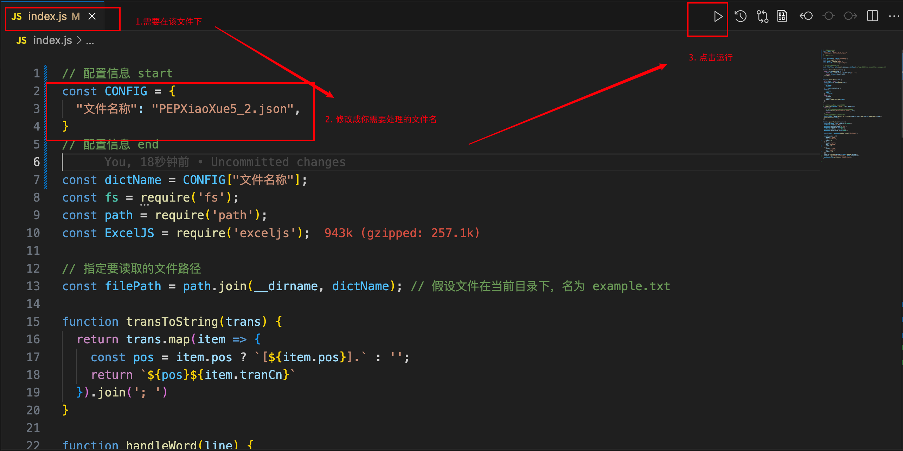

# 使用说明

## 环境安装指南

IDE —— VSCode
IDE 插件 ——
  Code Runner（author: Jun Han）
  Markdown Preview Enhanced（author: Yiyi Wang）
版本管理工具 —— GIT
软件运行环境 —— Node.js

## 所需资源

[resource](https://github.com/kajweb/dict)

## 操作指南

运行方式：

1. 打开 index.js 文件
2. 修改配置信息
3. 点击右上角 ▶️ 运行即可

## 关于ExcelJS学习环境

[API说明文档](https://github.com/exceljs/exceljs/blob/master/README_zh.md)

test.js 文件
